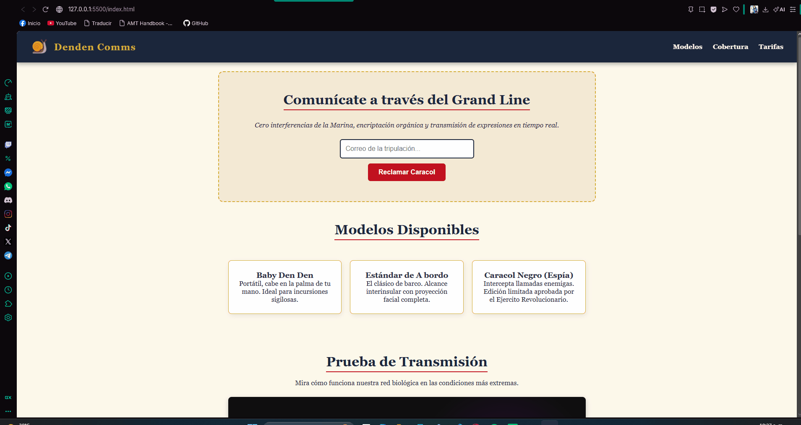

# 🐌 Denden Comms — Product Landing Page

¡Bienvenido a **Denden Comms**! Este proyecto es una *Product Landing Page* inspirada en el universo de **One Piece**, desarrollada como el proyecto final para obtener la certificación de **Responsive Web Design** de **freeCodeCamp**.

---

## 🚀 Sobre el Proyecto

**Denden Comms** es la plataforma ficticia líder en telecomunicaciones dentro del Grand Line. Ofrece caracoles transmisores (*Den Den Mushi*) con encriptación orgánica, alcance interinsular y transmisión facial en tiempo real para piratas, revolucionarios y aventureros.

El objetivo principal fue cumplir con las 25 historias de usuario e inspecciones automáticas de freeCodeCamp, aplicando las mejores prácticas de **HTML5 semántico** y **CSS3** (Flexbox, Media Queries, posicionamiento y diseño adaptativo).

---

## 🛠️ Tecnologías Utilizadas

- **HTML5:** Estructura semántica accesible (`<header>`, `<nav>`, `<main>`, `<section>`, `<form>`).
- **CSS3:** 
  - Layout dinámico con **CSS Flexbox**.
  - Diseño responsivo mediante **Media Queries** (`@media`).
  - Posicionamiento fijo (`position: fixed`) para navegación persistente.
  - Relación de aspecto adaptable para video embebido (16:9).
- **Git & GitHub:** Control de versiones y despliegue continuo.

---

## ✨ Características Principales

- **Barra de navegación fija:** El menú permanece accesible en todo momento en la parte superior del *viewport*.
- **Integración multimedia:** Demostración de producto integrada mediante `<iframe>` con respuesta fluida en dispositivos móviles.
- **Formulario validado:** Captura de correos de tripulantes con validación nativa de HTML5.
- **Catálogo de productos y tarifas:** Organización limpia en tarjetas utilizando Flexbox.
- **Diseño Responsive:** Adaptabilidad completa para pantallas pequeñas y móviles.

---

## 📱 Vista Previa & Captura

El proyecto incluye un artefacto visual de demostración en la carpeta `assets/`:
├── assets/
│   └── preview.png
├── index.html
├── styles.css
└── README.md

---

## 👤 Autor

Desarrollado con dedicación por **Josue Vasquez**.

- GitHub: [@josuevasquez2305](https://github.com/josuevasque2305)
- Proyecto de certificación: freeCodeCamp — Responsive Web Design